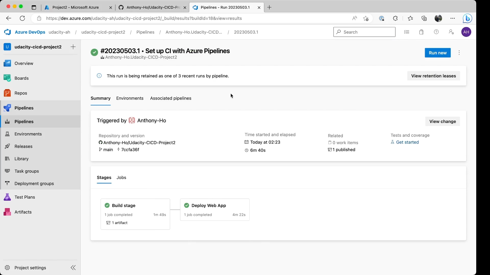

# Overview

[](https://github.com/Anthony-Ho/Udacity-CICD-Project2/actions/workflows/python-app.yml)

The objective of the project is to demonstrate:

1. Using Github to complete continuous integration of an application; and
2. Using Azure Pipeline to perform both continuous delivery of an application.

## Project Plan

* A link to a Trello board for the project, [My Trello Board](https://trello.com/invite/b/GLPEQyB4/ATTId0375e6f976ea3a3b997051cbf2e9acb9F5AEA86/udacity-ci-cd-project)
* A link to a spreadsheet that includes the original and final project plan, [High-Level Project Plan](https://1drv.ms/x/s!Au3p6w0ds_fCgqBlz-rW5nQ475YwlA?e=mbFlLI)

## Instructions

* Architectural Diagram (Shows how key parts of the system work) is as follows:  
  


### Setup Instructions

* Setting up a `Github` repository for this `Azure Webapp` Service. 
    * Go to your Github how page, either using the `New` button on the left hand side repository panel or the drop down `+` menu on the top right hand corner and select `New Repository` to create a new repository.
    * Enter the new project name and select `python` at the `.gitignore` button so that Github will automatically exclude keeping track on some system generated files other than your source code.
    * The following screen show the screen creating the Github project:
      

* Project cloned into Azure Cloud Shell
    * open Azure Cloud Shell from your Azure Portal
    * ensure you have setup the SSH access to your Github account on your Azure Cloud Shell.  Detail procedure could be found in [Connect With SSH](https://docs.github.com/en/authentication/connecting-to-github-with-ssh/about-ssh), and [Add a new SSH key](https://docs.github.com/en/authentication/connecting-to-github-with-ssh/adding-a-new-ssh-key-to-your-github-account) from Github documentation.
    * Then, you can copy the SSH link of your newly created repository and using the following comand to clone your repository to your Azure Cloud Shell.
        ```bash
        anthony [ ~ ] $ git clone <your-github-project-ssh-link>
        ```
    * The following shows the screen after successful cloning repository from Github.
      


* Passing tests that are displayed after running the `make all` command from the `Makefile`
    * Then we can create scafolding code for testing of Github Action, including `hello.py`, `Makefile`, `requirements.txt` and `test_hello.py`.
    * We should create a virtual python environment for the code testing and continuous integration such as the following:
        ``` bash
        anthony [ ~ ]$ python -m venv cicd
        anthony [ ~ ]$ source cicd/bin/activate
        ```
    * Then, we should edit the `Makefile` to include the actions required for 2 stages, i.e. `install`, `lint`, and `test` as follows:
    * The we can run `make all` on Azure Cloud Shell to check any possible errors on our scaffolding codes.  The pass result should be similar as follows:
      
    
* Output of a test run
    * After `make all` is passed, we can create a `Github Actions`.
    * Go to your `Github` repository page and select the `Actions` tab.  Then, `Github` will suggest templates for your project.  For simiplicity, `Python Application` us selected.
    * Then, we have to modify the `python-app.yml` to do '`make install`', '`make lint`', and '`make test`' at different stages of `Actions`, for example as shown in the following screen capture. 
      
    * Then, use the "`Start Commit`" button on the top right hand corner to commit the edited file to push to your repository.  Once new commit is pushed to the repository, the `Github Actions` will start to run the integration jobs as stated in the file.
    * If everything is fine, the following results could be found.
    
      

* Prepare the Flask Starter code and Configure the Azure Pipeline for Continous Delivery
    * Copy all neccessary Flask Starter files, including at least `app.py`, `requirements.txt`, `Housing_price_models/*`, `README.md`, `make_prediction.sh`, and `make_predictt_azure_app.sh`.
    * Test whether the flask application can run on Azure Cloud Shell, 
        * "`make install; python -m flask run`"
        * Check the port of the flask program is running and then edit the `make_prediction.sh` with the correct port number, then we should have the correct prediction and result like to followin:
        ```bash
        anthony [ ~ ]$ ./make_prediction.sh
        Port: 5000
        {"prediction":[20.35373177134412]}  
        ```
    * Test if we can deploy the starter code as an Azure Webapp service,
        * using command, "`az webapp up -g <resource_group> -n <app_name>`"
        * after the successful deployment of the webapp, we should have the URL to access from the retuen JSON output as shown in the following diagram.
        
        * Check the Azure portal or follow the link from the result to check if the service endpoint is up and running.
        * Then, edit the correct URL in the `make_predict_acure_app.sh`.  IF the service runs, we should have the result like the following:
        ```bash
        anthony [ ~ ]$ ./make_prediction.sh
        Port: 443
        {"prediction":[20.35373177134412]} 
        ```  

* Then, we can setup the azure pipeline ans we could referred the details to the [offical documentation](https://docs.microsoft.com/en-us/azure/devops/pipelines/ecosystems/python-webapp?view=azure-devops).
    * Go to `Azure Devops` to create your development organization and create a new project.
    * Go to your new project and select `Pipeline` from you left hand side panel, and then create a new pipeline.
    * Select repository as "`Github`", select your project code repository and then anthenicate and authorize Azure Devops to access your `Github` repository.
    * Then configure using "`Python to Linux Web App on Azure`" as template to configure your pipeline. Then, we have to authorize the Pipeline to use your Azure resources.
    * Edit the pipeline YAML file(e.g. using the correct version of python).
    * After "`Save and Commit`" the YAML file, the new file will be committed to your repository and then pipeline will execute.  The following figure shows the create pipeline successfully run.
    

 * Then, we can test the newly automatic deploy webapp by using "`make_predict_azure_app.sh`", the successful result will be similar to the following:
    ```bash
    anthony [ ~ ]$ ./make_prediction.sh
    Port: 443
    {"prediction":[20.35373177134412]} 
    ```

* Load test the deployed webapp using "`locust`".  The following are screen capture of the "`locust`" test result.  

    
    


* Output of streamed log files from deployed application.  The following is the sample of log file captured for starting the log as well as the log message when requests were received.
    ```
    WARNING: 2023-05-03T01:52:58  Welcome, you are now connected to log-streaming service.
    WARNING: 
    Starting Log Tail -n 10 of existing logs ----

    /home/LogFiles/__lastCheckTime.txt  (https://udacity-cicd-project2.scm.azurewebsites.net/api/vfs/LogFiles/__lastCheckTime.txt)
    05/03/2023 00:39:12


    /home/LogFiles/kudu/trace/3e0a79d63461-57a6462f-f45b-48da-a672-894d76f7dece.txt  (https://udacity-cicd-project2.scm.azurewebsites.net/api/vfs/LogFiles/kudu/trace/3e0a79d63461-57a6462f-f45b-48da-a672-894d76f7dece.txt)
    2023-05-03T00:39:47  Startup Request, url: /api/zipdeploy?isAsync=true, method: POST, type: request, pid: 86,1,5, SCM_DO_BUILD_DURING_DEPLOYMENT: True, ScmType: None


    /home/LogFiles/kudu/trace/3e0a79d63461-edf71fe2-bd62-4ae0-8087-7af42c2068a6.txt  (https://udacity-cicd-project2.scm.azurewebsites.net/api/vfs/LogFiles/kudu/trace/3e0a79d63461-edf71fe2-bd62-4ae0-8087-7af42c2068a6.txt)
    2023-05-03T00:46:32    Error occurred, type: error, text: LogStreamManager: ProcessRequest end
    2023-05-03T00:46:32  Error occurred, type: error, text: LogStreamManager: Inside Reset


    /home/LogFiles/kudu/trace/9d0fb79cc51d-047fd8c5-bcaf-4ac9-b9b2-e7394c0f7ebc.txt  (https://udacity-cicd-project2.scm.azurewebsites.net/api/vfs/LogFiles/kudu/trace/9d0fb79cc51d-047fd8c5-bcaf-4ac9-b9b2-e7394c0f7ebc.txt)
    2023-05-03T01:50:52    Error occurred, type: error, text: LogStreamManager: ProcessRequest end
    2023-05-03T01:50:52  Error occurred, type: error, text: LogStreamManager: Inside Reset


    /home/LogFiles/kudu/trace/9d0fb79cc51d-14d7c41a-bfb3-4b2b-8110-15a0d437d020.txt  (https://udacity-cicd-project2.scm.azurewebsites.net/api/vfs/LogFiles/kudu/trace/9d0fb79cc51d-14d7c41a-bfb3-4b2b-8110-15a0d437d020.txt)
    2023-05-03T01:49:58    Error occurred, type: error, text: LogStreamManager: ProcessRequest end
    2023-05-03T01:49:58  Error occurred, type: error, text: LogStreamManager: Inside Reset


    /home/LogFiles/kudu/trace/9d0fb79cc51d-2f852625-21d9-4651-9b5e-90392fcf8c99.txt  (https://udacity-cicd-project2.scm.azurewebsites.net/api/vfs/LogFiles/kudu/trace/9d0fb79cc51d-2f852625-21d9-4651-9b5e-90392fcf8c99.txt)
    2023-05-03T01:30:05    Outgoing response, type: response, statusCode: 404, statusText: NotFound


    /home/LogFiles/kudu/trace/9d0fb79cc51d-517c6b82-84f3-4cc8-ab0d-d8221d699b23.txt  (https://udacity-cicd-project2.scm.azurewebsites.net/api/vfs/LogFiles/kudu/trace/9d0fb79cc51d-517c6b82-84f3-4cc8-ab0d-d8221d699b23.txt)
    2023-05-03T01:43:02    Error occurred, type: error, text: LogStreamManager: ProcessRequest end
    2023-05-03T01:43:03  Error occurred, type: error, text: LogStreamManager: Inside Reset


    /home/LogFiles/kudu/trace/9d0fb79cc51d-ce0ada8d-c1c8-4ced-aa7a-1f6456f95024.txt  (https://udacity-cicd-project2.scm.azurewebsites.net/api/vfs/LogFiles/kudu/trace/9d0fb79cc51d-ce0ada8d-c1c8-4ced-aa7a-1f6456f95024.txt)
    2023-05-03T01:40:55    Error occurred, type: error, text: LogStreamManager: ProcessRequest end
    2023-05-03T01:40:55  Error occurred, type: error, text: LogStreamManager: Inside Reset


    /home/LogFiles/kudu/trace/9d0fb79cc51d-d2d6c566-e6b8-4b3a-b103-215f4dc21e5a.txt  (https://udacity-cicd-project2.scm.azurewebsites.net/api/vfs/LogFiles/kudu/trace/9d0fb79cc51d-d2d6c566-e6b8-4b3a-b103-215f4dc21e5a.txt)
    2023-05-03T01:29:55  Startup Request, url: /api/deployments/181683077390721, method: PUT, type: request, pid: 86,1,5, SCM_DO_BUILD_DURING_DEPLOYMENT: True, ScmType: VSTSRM


    /home/LogFiles/2023_05_03_pl0sdlwk000306_default_docker.log  (https://udacity-cicd-project2.scm.azurewebsites.net/api/vfs/LogFiles/2023_05_03_pl0sdlwk000306_default_docker.log)

    2023-05-03T01:49:56.833366922Z 169.254.129.1 - - [03/May/2023:01:49:56 +0000] "GET / HTTP/1.1" 200 32 "-" "AlwaysOn"

    2023-05-03T01:51:47.660306756Z 169.254.129.1 - - [03/May/2023:01:51:47 +0000] "GET / HTTP/1.1" 200 32 "https://sandbox-22-5.reactblade.portal.azure.net/" "Mozilla/5.0 (Macintosh; Intel Mac OS X 10_15_7) AppleWebKit/537.36 (KHTML, like Gecko) Chrome/112.0.0.0 Safari/537.36 Edg/112.0.1722.68"

    2023-05-03T01:51:56.702655952Z [2023-05-03 01:51:56,701] INFO in app: JSON payload: %s json_payload
    2023-05-03T01:51:56.707877870Z [2023-05-03 01:51:56,707] INFO in app: inference payload DataFrame: %s 
    WARNING: inference_payload
    2023-05-03T01:51:56.712679579Z [2023-05-03 01:51:56,708] INFO in app: Scaling Payload: %s payload
    2023-05-03T01:51:56.724542548Z 169.254.129.1 - - [03/May/2023:01:51:56 +0000] "POST /predict HTTP/1.1" 200 36 "-" "curl/8.0.1"


    /home/LogFiles/2023_05_03_pl0sdlwk000306_docker.log  (https://udacity-cicd-project2.scm.azurewebsites.net/api/vfs/LogFiles/2023_05_03_pl0sdlwk000306_docker.log)
    2023-05-03T01:29:37.763Z INFO  - 3.10_20230323.2.tuxprod Pulling from appsvc/python
    2023-05-03T01:29:37.765Z INFO  -  Digest: sha256:5abb82cb6fa08cec200e3c7275f3852735c90ab9352728997785f1e5f8ed6f97
    2023-05-03T01:29:37.766Z INFO  -  Status: Image is up to date for mcr.microsoft.com/appsvc/python:3.10_20230323.2.tuxprod
    2023-05-03T01:29:37.772Z INFO  - Pull Image successful, Time taken: 0 Minutes and 0 Seconds
    2023-05-03T01:29:37.826Z INFO  - Starting container for site
    2023-05-03T01:29:37.828Z INFO  - docker run -d --expose=8000 --name udacity-cicd-project2_4_3428e7d8 -e WEBSITE_SITE_NAME=udacity-cicd-project2 -e WEBSITE_AUTH_ENABLED=False -e WEBSITE_ROLE_INSTANCE_ID=0 -e WEBSITE_HOSTNAME=udacity-cicd-project2.azurewebsites.net -e WEBSITE_INSTANCE_ID=13895ed294e8e6e1fd7e45c7686da1c44ef54f95894a7c401a4157819d95e64d -e HTTP_LOGGING_ENABLED=1 -e WEBSITE_USE_DIAGNOSTIC_SERVER=False appsvc/python:3.10_20230323.2.tuxprod  

    2023-05-03T01:29:39.199Z INFO  - Initiating warmup request to container udacity-cicd-project2_4_3428e7d8 for site udacity-cicd-project2
    2023-05-03T01:29:57.640Z INFO  - Waiting for response to warmup request for container udacity-cicd-project2_4_3428e7d8. Elapsed time = 18.4406626 sec
    2023-05-03T01:30:09.562Z INFO  - Container udacity-cicd-project2_4_3428e7d8 for site udacity-cicd-project2 initialized successfully and is ready to serve requests.


    /home/LogFiles/AppServiceAppLogs_Feature_Installer/startup_0.log  (https://udacity-cicd-project2.scm.azurewebsites.net/api/vfs/LogFiles/AppServiceAppLogs_Feature_Installer/startup_0.log)
    2023-05-03 00:50:37,971  [MainThread] [DEBUG] : Initialized AppServiceAppLogging
    2023-05-03 00:50:43,166  [Thread-3 (] [DEBUG] : Waiting for the logs flag to be set
    2023-05-03 01:29:30,221  [MainThread] [DEBUG] : Initializating AppServiceAppLogging 
    2023-05-03 01:29:30,223  [Thread-1 (] [DEBUG] : Did not find any previously bound socket
    2023-05-03 01:29:30,223  [MainThread] [DEBUG] : Initialized AppServiceAppLogging
    2023-05-03 01:29:37,423  [Thread-3 (] [DEBUG] : Waiting for the logs flag to be set
    2023-05-03 01:30:02,327  [MainThread] [DEBUG] : Initializating AppServiceAppLogging 
    2023-05-03 01:30:02,330  [Thread-1 (] [DEBUG] : Did not find any previously bound socket
    2023-05-03 01:30:02,331  [MainThread] [DEBUG] : Initialized AppServiceAppLogging
    2023-05-03 01:30:09,435  [Thread-3 (] [DEBUG] : Waiting for the logs flag to be set


    /home/LogFiles/CodeProfiler/13895e_debug.log  (https://udacity-cicd-project2.scm.azurewebsites.net/api/vfs/LogFiles/CodeProfiler/13895e_debug.log)
    [2023_05_03_01_30_09] [appsvc_profiler.installer] [INFO] Code Profiler Installer is starting up
    [2023_05_03_01_30_09] [appsvc_profiler.installer] [INFO] Cleaning up any existing status file which indicated signal handlers initialized status
    [2023_05_03_01_30_09] [appsvc_profiler.installer] [INFO] Attempting to delete the signal_handler status file for instance id 13895ed294e8e6e1fd7e45c7686da1c44ef54f95894a7c401a4157819d95e64d
    [2023_05_03_01_30_09] [appsvc_profiler.installer] [INFO] successfully deleted the status file
    [2023_05_03_01_30_09] [appsvc_profiler.installer] [DEBUG] APPSETTING_WEBSITE_ENABLE_DEFAULT_CODE_PROFILER : None
    [2023_05_03_01_30_09] [appsvc_profiler.installer] [INFO] Attempting to install the default code profiler.
    [2023_05_03_01_30_09] [appsvc_profiler.installer] [DEBUG] viztracer would save traces to /tmp/13895e_profiler_trace.json
    [2023_05_03_01_30_09] [appsvc_profiler.installer] [INFO] Successfully installed code profiler.
    [2023_05_03_01_30_09] [appsvc_profiler.installer] [INFO] Signal Handlers SIGUSR for needed code-profiler have been initialized for gunicorn process on instance 
    WARNING: 13895ed294e8e6e1fd7e45c7686da1c44ef54f95894a7c401a4157819d95e64d
    [2023_05_03_01_30_09] [appsvc_profiler.installer] [DEBUG] Code Profiler Installer is exiting as installation is completed


    Ending Log Tail of existing logs ---

    Starting Live Log Stream ---
    WARNING: 2023-05-03T01:53:14.109630803Z 169.254.129.1 - - [03/May/2023:01:53:14 +0000] "GET / HTTP/1.1" 200 32 "https://sandbox-22-5.reactblade.portal.azure.net/" "Mozilla/5.0 (Macintosh; Intel Mac OS X 10_15_7) AppleWebKit/537.36 (KHTML, like Gecko) Chrome/112.0.0.0 Safari/537.36 Edg/112.0.1722.68"
    WARNING: 2023-05-03T01:53:44.148216098Z [2023-05-03 01:53:44,147] INFO in app: JSON payload: %s json_payload

    2023-05-03T01:53:44.150599850Z [2023-05-03 01:53:44,149] INFO in app: inference payload DataFrame: %s inference_payload

    2023-05-03T01:53:44.151482969Z [2023-05-03 01:53:44,150] INFO in app: Scaling Payload: %s payload

    2023-05-03T01:53:44.161844895Z 169.254.129.1 - - [03/May/2023:01:53:44 +0000] "POST /predict HTTP/1.1" 200 36 "-" "curl/8.0.1"

    ```


> 

## Enhancements

* We can enhance to include both the continuous integration and continuous delivery using either `Github Actions` or `Azure Pipeline`, which can help to minimize the support efforts.
* For `Azure Pipeline` setup, we should alos consider to use "`self-hosted agent`" which the environment could be more specific to the application production requirements.  However, the down side is extra maintenance efforts should be alloted to ensure the stability and robustness of the deployment environment.
* We should also consider different actions, i.e. tasks, for various triggering events.  For example, deployment related tasks will only execute if "`main`" branch is push to the repository, but integration tasks, such as test and lint, should be done and triggered by all commit/push. on all branches.

## Demo 

* The [Demo Video](https://youtu.be/mNBRv9FfQh8).


